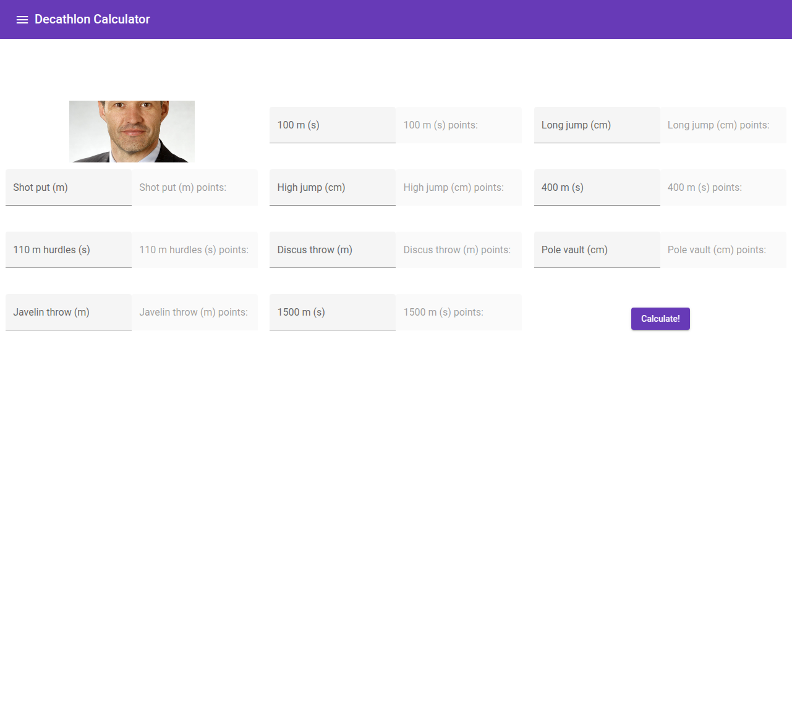

# Spring-Boot-Decathlon-Calculator

Spring-Boot-Decathlon-Calculator is a REST API for calculating decathlon scores. It is built using Java 11 for the backend with Spring Boot and Angular for the frontend.

## Features

* REST API for decathlon score calculations
* Angular frontend integrated into the Spring Boot application
* Docker support for easy deployment

## Technologies Used
* Java 11 
* Spring Boot 
* Angular 
* Gradle 
* Docker

## Getting Started

### Prerequisites
Make sure you have the following installed:
* Java 11
* Node.js & npm (for the Angular frontend)
* Gradle
* Docker (optional, for containerized deployment)

### Installation
1. Clone the repository
```bash
git clone https://github.com/yourusername/Spring-Boot-Decathlon-Calculator.git
cd Spring-Boot-Decathlon-Calculator
```

2. Build the project
```bash
gradle build
```

3. Run the backend
```bash
java -jar build/libs/Spring-Boot-Decathlon-Calculator.jar
```

4. Run the frontend
```bash
cd src/main/webapp
npm install
npm start
```

### Running with Docker

Build and run the application inside a Docker container:

```bash
docker build -t decathlon-calculator .
docker run -p 8080:8080 decathlon-calculator
```

## API Endpoints

| Method | Endpoint             | Description                |
|--------|----------------------|----------------------------|
| GET    | /api/sport           | Get  sports                |
| GET    | /api/results         | Get results                |
| POST   | /api/calculatepoints | Calculate decathlon points |

## Screenshot


